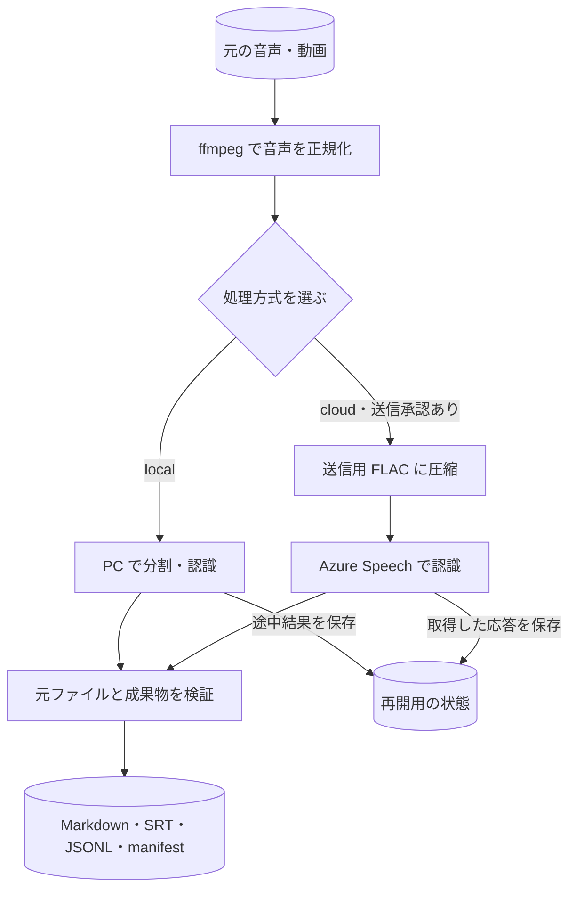

# tkn-audio-transcriber: 音声・動画を文字起こしする CLI

音声ファイルや動画の音声を、時刻付きの Markdown 文字起こし、SRT 字幕、JSONL データに変換する CLI です。音声認識には、PC 上の `faster-whisper` または Azure Speech Fast Transcription を選べます。元のメディアは変更しません。

例えば `meeting.flac` を処理すると、主成果物 `meeting__local__local-small_transcript.md` に次のような本文ができます。これは形式を示す架空の抜粋です。

```text
# meeting Transcript

## Transcript

[00:00:00 - 00:00:03] おはようございます。会議を始めます。
```

初めて使う場合は、[処理方式と対象範囲](#処理方式と対象範囲)から[最初の文字起こし](#最初の文字起こし)まで順に進めてください。設定の選択や再開方法は後半の各節から参照できます。[変更履歴](CHANGELOG.md)には版ごとの変更を記録しています。

## 処理方式と対象範囲

`ffmpeg` が先頭の音声ストリームをモノラル 16 kHz に変換し、選択した音声認識サービスが文字にします。動画の映像フレームは使いません。入力は、`ffmpeg` がデコードでき、音声ストリームを含むローカルファイルです。例として `.wav`、`.flac`、`.mp3`、`.m4a`、`.mp4` を扱えます。

| 処理方式 | 音声認識を行う場所 | 音声の送信 | 主な用途 |
| --- | --- | --- | --- |
| `local` | この PC の `faster-whisper` | 音声は送信しない。未取得モデルの初回ダウンロードには Hugging Face への接続が必要 | ローカルで処理したい場合 |
| `cloud` | Azure Speech Fast Transcription | 実行ごとに `--allow-cloud-upload` を指定した場合に、派生 FLAC 音声を設定済み Speech リソースへ送信 | Azure の認識や話者分離を使う場合 |

通常の `transcribe` 実行は、次の順に進みます。円筒形はファイルや保存データ、長方形は処理、ひし形は処理方式の選択を表します。矢印は処理順とデータの受け渡しを示します。



Azure へ送るのは派生 FLAC 音声で、元の動画や映像フレームは送りません。`--dry-run` は入力と出力予定を確認する段階で止まり、図中の音声変換・認識・保存は行いません。

設定で選ぶ `MODE/PROFILE` は、処理方式とその中の名前付き設定です。初期設定は `local/local-small` で、CPU と `small` モデルを使います。Azure の実行には通信と課金が発生し得るため、[Azure の手順](#azure-speech-で文字起こしする)で設定と承認条件を確認してください。

この CLI は音声認識、再開、検証、成果物作成までを扱います。要約や文章の補正は成果物を確認してから別途行います。ローカル認識の結果には話者ラベルが付きません。

## 必要なもの

- Windows 10/11 または Linux、Python 3.12 以上、[uv](https://docs.astral.sh/uv/)。
- `PATH` から実行できる `ffmpeg`、または設定済みの `processing.ffmpeg.executable`。
- 入力ファイルと、正規化 WAV・途中データ・最終成果物を保存できる空き容量。

最初の手順は CPU 上のローカル認識を使います。Windows で GPU を使う場合は [CUDA の準備](#windows-で-cuda-を使う)が必要です。Azure を使う場合は Speech User ロールを持つ Entra ID、ブラウザー操作と `localhost` コールバックが可能なデスクトップ環境、Microsoft Entra と Speech エンドポイントへの接続が必要です。Azure CLI は使いません。

## インストール

PowerShell で、取得済みのリポジトリに移動して通常のツールとしてインストールします。`C:\path\to\tkn_audio_transcriber` は実際のリポジトリの場所に置き換えてください。

```powershell
cd "C:\path\to\tkn_audio_transcriber"
uv tool install .
tkn-audio-transcriber --version
```

`tkn-audio-transcriber 0.10.0` のようにパッケージのバージョンが表示されれば導入できています。コマンドとオプションは `tkn-audio-transcriber --help`、各コマンドの詳細は `tkn-audio-transcriber transcribe --help` などで確認できます。

## 初期設定

`config init` でユーザー設定 `~/.tkn/audio_transcriber/config.yaml` を作ります。同梱の設定では `local/local-small` が選ばれており、CPU での初回実行には編集が不要です。`config show` は適用される設定とその出典を JSON で表示します。

```powershell
tkn-audio-transcriber config init
tkn-audio-transcriber config show
```

新規作成した同梱設定なら、`config show` の `active_mode` は `local`、`active_profile` は `local-small` です。出力先は `values.output_dir.value` に作業ディレクトリの絶対パスとして表示されます。既存の編集済み設定は `config init` だけでは上書きされないため、値が異なる場合は表示された設定を確認してください。

作業フォルダごとに変更したい場合は、次のコマンドで `./.tkn/config.yaml` を作れます。既存設定を編集するときは他の項目を残してください。

```powershell
tkn-audio-transcriber config init .tkn/config.yaml
tkn-audio-transcriber config profiles
```

同梱されるローカル設定は `local-small`、`local-large`、`gpu-quality`、`gpu-fast`、Azure 設定は `azure-ja` です。通常使う設定は YAML の `transcription.active` で選び、1 回だけ切り替える場合は `--profile MODE/NAME` をコマンド名より前に指定します。

```yaml
# config.yaml の transcription 部分だけを変更する例
transcription:
  active:
    mode: local
    profile: local-large
```

出力先の既定値は作業ディレクトリです。初回実行では `--output-dir` で場所を明示します。設定の詳しい選び方は [ローカルプロファイル](#ローカルプロファイルを調整する)と[設定の優先順位](#設定の優先順位)を参照してください。

## 最初の文字起こし

手元の音声ファイルに合わせて入力パスを置き換えます。次の例は `meeting.flac` をローカルで認識し、`C:\path\to\transcripts` に成果物を保存します。通常実行はモデルの自動取得、途中状態と成果物の作成を行います。モデルが未取得なら、初回に Hugging Face への接続が必要です。

実行前に入力と出力予定を確認する場合は、`--dry-run` を使います。これは認識やモデル取得をせず、出力・状態・キャッシュを作りません。

```powershell
tkn-audio-transcriber transcribe "C:\path\to\meeting.flac" --output-dir "C:\path\to\transcripts" --dry-run
```

同じ引数から `--dry-run` を外して実行します。

```powershell
tkn-audio-transcriber transcribe "C:\path\to\meeting.flac" --output-dir "C:\path\to\transcripts"
```

標準出力の `status: created` と `outputs:` 以下のパスを確認し、`markdown:` に表示された `*_transcript.md` を開きます。本文には時刻付きの認識結果が入り、SRT 字幕、JSONL データ、検証用 manifest も同じ出力先に作られます。文字起こしの正確さは自動検証の対象外なので、重要な固有名詞、日時、否定表現は原音と照合してください。

成果物のサイズと SHA-256 を検査する場合は、表示された manifest のパスを指定します。

```powershell
tkn-audio-transcriber validate "C:\path\to\transcripts\meeting__local__local-small_transcript.manifest.json"
```

## 再実行と日常の操作

同じ入力・設定で有効な成果物がすでにあれば `status: unchanged` となります。中断後は同じ `transcribe` コマンドを実行します。ローカル認識は完了済みチャンクを再利用し、Azure 認識は取得済み応答があれば再送せずに再利用します。実行状況と最終 heartbeat は `status` で確認できます。

```powershell
tkn-audio-transcriber status
```

異なる、または不完全な最終成果物が既にある場合は停止します。内容を置き換えると決めたときだけ `--overwrite` を指定してください。結果を比較して残す場合は別のプロファイル名または出力先を使います。[再実行と失敗時の動作](#再実行と失敗時の動作)に状態ごとの扱いをまとめています。

## コマンド一覧

| 目的 | コマンド | 説明 |
| --- | --- | --- |
| 設定を作る | [`config init`](#config-init) | 同梱例から設定を作る。既存の編集済み設定は保護する |
| 設定を確認する | [`config show`](#config-show)、[`config profiles`](#config-profiles) | 有効値・出典、利用可能なプロファイルを表示する |
| 旧設定を移す | [`config migrate`](#config-migrate) | 旧スキーマを検証し、バックアップ後に更新する |
| モデルを事前取得する | [`model download`](#model-download) | ローカル認識モデルをダウンロードする |
| 文字起こしを作る | [`transcribe`](#transcribe) | 音声・動画から 4 種類の成果物を作る |
| 状況・成果物を調べる | [`status`](#status)、[`validate`](#validate) | 保存済みジョブの状態や出力ハッシュを確認する |
| 完了済みの途中状態を整理する | [`cleanup`](#cleanup) | 対象を表示し、`--apply` 指定時だけ削除する |

## 成果物と保存先

`meeting.flac` を `local/local-small` で処理すると、指定した出力先に次の 4 ファイルを作成します。`__local__local-small` は選択した処理方式とプロファイルを表します。別のプロファイルで同じ入力を処理すると、別名の一式になります。

```text
meeting__local__local-small_transcript.md
meeting__local__local-small_transcript.srt
meeting__local__local-small_transcript.jsonl
meeting__local__local-small_transcript.manifest.json
```

| ファイル | 使い方 |
| --- | --- |
| `*_transcript.md` | 時刻付き本文を読む主成果物。Frontmatter に入力名、プロファイル、モデル、言語、ツールのバージョンなどを記録 |
| `*_transcript.srt` | 再生ソフトや動画編集ソフトで使う字幕。Azure で話者情報が返された場合はラベルを含む |
| `*_transcript.jsonl` | 1 行 1 JSON オブジェクトの区間データ。後続の処理に使う |
| `*_transcript.manifest.json` | 入力ハッシュ、設定、実行情報、出力ハッシュを記録する検証用ファイル。`validate` の入力に使う |

最終成果物の既定の保存先は実行時の作業ディレクトリです。`--output-dir` または `folders.output` で変更できます。設定内の相対パスも作業ディレクトリを基準に解決します。旧版で作成したプロファイル名のない成果物は移動・上書きしません。

途中データは次の場所に分けて保存します。

```text
~/.tkn/audio_transcriber/state/          再開用のジョブ記録とチェックポイント
~/.cache/audio_transcriber/models/       再取得可能な音声認識モデル
~/.cache/audio_transcriber/huggingface/  再取得可能なダウンロードキャッシュ
```

`state` を失うと未完了の認識を途中から再開できません。モデルやキャッシュを削除した場合は、次回の取得に通信と時間が必要です。manifest には元メディアのパスとハッシュも記録するため、共有先を選ぶときはこの情報を確認してください。

## コマンドの詳細

### `config init`

application-ownedなpackage exampleから完全な設定を作成します。
書き込まずに確認する場合は`--dry-run`、編集済みfileをbackupして置換する場合は`--force`を指定します。

```console
tkn-audio-transcriber config init --dry-run
tkn-audio-transcriber config init
```

### `config show`

解決後の非secret設定、各値のsource、各設定sourceのschema version、effective schema version、in-memory migrationの有無をJSONで表示します。
読み取り専用であり、ディレクトリを作成しません。

```console
tkn-audio-transcriber config show
tkn-audio-transcriber --config "C:\path\to\config.yaml" config show
tkn-audio-transcriber --profile local/gpu-quality config show
```

### `config profiles`

local/cloud別の名前付き文字起こしprofile、各provider、activeな選択を一覧表示します。
読み取り専用です。
YAMLを編集せずに別profileを確認するときは、global `--profile`を使います。

```console
tkn-audio-transcriber config profiles
tkn-audio-transcriber --profile local/gpu-quality config profiles
```

`--provider`単独指定はありません。
providerを変える場合は`local/NAME`または`cloud/NAME`を選びます。
local profileにAzure専用option、cloud profileにWhisper専用optionを渡すと設定errorになります。

### `config migrate`

平坦なschema 1.x設定または混在profile形式のschema 2設定を、schema 3のlocal/cloud分離構造へ移行します。
移行後の設定を検証し、元fileの隣にbackupを作ってから原子的に置換します。
`--dry-run`では書き込まずに計画を確認できます。
pathを省略した場合はユーザー設定が対象です。

```console
tkn-audio-transcriber config migrate --dry-run
tkn-audio-transcriber config migrate
tkn-audio-transcriber config migrate .tkn/config.yaml
```

### `model download`

`faster-whisper`モデルを設定済みのmodel directoryへダウンロードします。
Hugging Faceへのnetwork accessを使いますが、元のメディアや文字起こし出力には触れません。
完全なモデルがすでにある場合は`unchanged`を返します。
文字起こし前に準備する場合や、network接続が利用できる間に取得しておく場合に使用します。

```console
tkn-audio-transcriber model download small
tkn-audio-transcriber model download medium --model-dir "D:\models"
```

### `transcribe`

元メディアの検証とhash計算、派生音声の正規化、選択providerでの音声認識、元メディアが変わっていないことの再検証、出力確定を順に行います。
local modeは再開可能なchunkを作り、Azure modeは可逆圧縮したFLAC全体を1 requestで送ります。

動画ファイルでは、`ffmpeg`が先頭の音声ストリーム（`0:a:0`）を選択し、映像ストリームを破棄します。
元動画は変更せず、出力名には元動画のファイル名（拡張子を除く）を使います。

```powershell
tkn-audio-transcriber transcribe "C:\path\to\meeting.m4a" `
  --output-dir "C:\path\to\transcripts" `
  --model small --language ja --chunk-seconds 600
```

MP4録画も同じコマンドで処理できます。

```powershell
tkn-audio-transcriber transcribe "C:\path\to\town-hall.mp4" `
  --output-dir "C:\path\to\transcripts" `
  --model small --language en
```

安全性に関する主なoptionは次のとおりです。

- `--dry-run`: output、state、cache、reportを一切変更しない
- `--overwrite`: 内容が異なる、または不完全な既存の最終出力だけを置換する。
  指定しない場合は停止する
- `--keep-working-files`: 検証成功後も正規化WAV、cloud用FLAC、local用チャンクを保持する。
  監査・再開用checkpointは常に保持する
- `--allow-cloud-upload`: この実行だけAzure uploadを承認する。設定fileからは読まない

選択modeが`local`の場合、設定した既知model（`tiny`、`base`、`small`、`medium`、`large-v3`）がなければ、音声処理前に自動ダウンロードします。
`--dry-run`ではダウンロードしません。
中断した場合は同じ`transcribe`コマンドを再実行すると、完了済みチャンクを飛ばして再開します。

`chunk_seconds`（CLIでは`--chunk-seconds`）は、local modeで正規化WAVを何秒ごとに分割するかを指定する正の整数で、既定値は`600`（10分）です。
Azure modeでは使用しません。
短い値ほどcheckpointが頻繁になり、中断時にやり直す範囲が小さくなる一方、分割・認識・保存の回数が増えます。
長い値ではそのoverheadを抑えられますが、1チャンクの途中で中断した場合にやり直す範囲が大きくなります。
設定を省略しても分割は無効にならず、既定値の`600`が使われるため、省略自体で処理が速くなることはありません。

通常は`600`を推奨します。
不安定な環境や頻繁な中断が想定される場合は`300`程度、安定したGPU環境でcheckpoint間隔を長くしたい場合は`900`～`1800`程度が目安です。
値は主に処理速度と再開性のtrade-offですが、チャンク間に音声の重複がないため、短くしすぎると境界で単語や文が切れて認識漏れや誤認識が増える可能性があります。

開始前にscratch容量を概算し、正規化後は実際のWAV容量からチャンク作成分またはcloud用FLAC圧縮分を再確認します。
正規化WAVの形式が不正な場合や、再生時間と全チャンクの合計時間が一致しない場合は、最終outputを確定しません。
local文字起こしのsegmentがdecode済みチャンクの末尾を部分的に越えた場合は末尾へ補正し、decode済み音声の完全に外側にあるsegmentは除外します。
補正件数とdecode済み音声情報はmanifestの`decoded_audio`へ記録します。
各stageとheartbeatはjobの`job.json`と`run.jsonl`へ保存します。

### `cleanup`

完了済みのジョブ状態を、保持日数に従って整理します。既定は削除対象を表示するだけです。

> [!WARNING]
> `--apply` を付けると、対象のチェックポイントを削除します。削除した途中状態は復元できません。最初のコマンドで対象を確認してください。

```console
tkn-audio-transcriber cleanup --older-than-days 30
tkn-audio-transcriber cleanup --older-than-days 30 --apply
```

対象になるのは、`completed`で、retention期間を過ぎ、最終manifestと全outputのsize・SHA-256検証に成功したjobだけです。
`running`、`failed`、manifest不正のjobは削除せず、model cache、Hugging Face cache、最終文字起こしoutputも対象外です。
`--apply`後に消したcheckpointは元に戻せませんが、検証済みの最終outputは残ります。

### `status`

永続job stateを読み、実行段階、現在のチャンク、PID、最終heartbeat、最終checkpoint、run logの場所をJSONで表示します。
読み取り専用です。

```console
tkn-audio-transcriber status
tkn-audio-transcriber status --state-dir "D:\transcription-state"
```

heartbeatは既定60秒です。
`--heartbeat-seconds`または設定fileで変更できます。
これは長いASR処理が生存していることを示しますが、ASRの強制timeoutではありません。

### `validate`

manifest schemaと、全出力のfile size・SHA-256を検証します。
`--verify-source`を付けると元メディアも再度hash検証します。
新規実行は選択profile・provider・認証・API provenanceを含むmanifest schema 3を書きますが、既存schema 1・2 manifestも引き続き検証できます。

```powershell
tkn-audio-transcriber validate "C:\path\to\meeting__local__local-small_transcript.manifest.json"
tkn-audio-transcriber validate "C:\path\to\meeting__local__local-small_transcript.manifest.json" `
  --verify-source
```

## ローカルプロファイルを調整する

以下は`transcription.modes.local.profiles.<name>`に指定する、ローカル`faster-whisper`用の設定です。
Azure Speechには適用しません。
推奨値は比較を始めるための候補であり、最高精度を保証するものではありません。

| 設定              | 意味と実用上の影響                                                                                                                                                                                                                         |
| ----------------- | ------------------------------------------------------------------------------------------------------------------------------------------------------------------------------------------------------------------------------------------ |
| `model`         | 音声認識モデル。品質重視なら多言語対応の`large-v3`。メモリや待ち時間が厳しければ`medium`、次に`small`を検討します。大型モデルでもすべての単語が改善するとは限りません。                                                              |
| `language`      | 音声の言語。日本語なら`ja`。このCLIでは空でない文字列が必要で、空欄/nullは自動判定の指定になりません。翻訳先言語ではありません。                                                                                                         |
| `chunk_seconds` | 音声ファイルの外部分割とcheckpointの間隔。正の整数秒で指定し、まずは`600`。短くすると中断時のやり直し範囲が減りますが、発話を切る境界が増えます。                                                                                        |
| `beam_size`     | 文字列の生成時に探索する候補の幅。`5`は品質を重視した出発点、`3`や`1`は時間短縮の候補です。増やしても誤認や幻覚が必ず減るわけではありません。                                                                                        |
| `compute_type`  | 計算精度・量子化方式。CUDAなら`float16`、CPUなら`int8`から始めます。CPUでも`float32`を使えますが、リソース消費と待ち時間が増え得ます。速度だけでなく認識文も変わりますが、計算精度の高さと文字起こし精度の高さは同義ではありません。 |
| `device`        | 推論の実行先。`cpu`またはNVIDIAの`cuda`。CUDAには下記runtimeが必要です。GPUは重い設定を速く動かす手段で、同じモデルの認識精度を本質的に上げるものではありません。                                                                      |

| 用途                                  | model                     | beam | compute     | device   |
| ------------------------------------- | ------------------------- | ---: | ----------- | -------- |
| CUDA・品質重視の基本設定              | `large-v3`              |    5 | `float16` | `cuda` |
| CPU・品質重視の比較候補               | `large-v3`              |    5 | `int8`    | `cpu`  |
| CPU・普段使いのリソース／時間バランス | `large-v3`              |    1 | `int8`    | `cpu`  |
| CPU・中間の速度／品質を試す           | `large-v3`              |    3 | `int8`    | `cpu`  |
| CPU・省メモリまたは簡易確認           | `medium`または`small` |    1 | `int8`    | `cpu`  |

日本語の比較では`language: ja`、`chunk_seconds: 600`を揃えます。
この表は同梱profileの追加・改名を意味しません。
32 GB級のCPU専用ノートPCでも`large-v3`は検討できますが、CPUの連続負荷、冷却、他アプリによって待ち時間や操作感が制約になります。
beamを下げる操作は主に探索量・処理時間を減らすもので、CPU使用率を制限する設定ではありません。
CPUスレッド数は現在profileから指定できません。
`float32`は自動的な上位設定とせず、重要な誤認があるときのA/B比較用とします。
対応型とハードウェア別の代替動作は[CTranslate2の計算型の説明](https://opennmt.net/CTranslate2/quantization.html)を参照してください。

### 分割と後工程の品質

現実装は文の切れ目を探す方式ではなく、固定時間で重なりなしに音声を分割します。
これは[Whisper内部の約30秒の処理窓](https://github.com/openai/whisper#python-usage)とは別のものです。
ローカルadapterではVAD（発話区間検出、最小無音500 ms）を有効にし、`temperature=0`、`condition_on_previous_text=False`で動作します。
そのため、外側のchunkを長くしても、会議全体を1つの文脈として認識するようにはなりません。
前の認識文を引き継ぐ機能を有効にするには別途コード変更が必要です。
一貫性と反復誤りのトレードオフは[faster-whisperのAPI](https://github.com/SYSTRAN/faster-whisper/blob/master/faster_whisper/transcribe.py)を参照してください。

758.8秒のベンチマーク音声では、`large-v3`、beam 5、float16、CUDA、日本語を揃え、
`600`（外部分割2個）と`900`（1個）を追加比較しました。
job記録上はいずれも41秒で、09:40.92までの最初の214 segmentは同一でした。
一方、1 chunkの結果では末尾に、`600`にはない不自然な名前風文字列が加わりました。
この音声では`900`による品質向上を確認できないため、開始値は`600`のままとします。
ただし`600`はapplication 0.7.0、`900`は0.7.1で、正解transcriptもないため、`600`が常に優れることを証明する比較ではありません。
別の値を試すときはapplication／model versionを揃え、境界だけでなく録音全体を原音で確認します。
`0`で分割を無効にする指定は未対応です。

原音とraw文字起こしは変更せずに保管します。
contextやglossaryを使った補正は専門用語の改善に役立ちますが、流暢な文章にも誤った追加や欠落が隠れます。
補正結果は原音の時刻と変更履歴を持つ別成果物にし、人名・数値・日時・否定・発言者を意思決定に使う前に原音で確認します。
ローカルASRは話者分離をしないため、本文中の名前風の接頭辞を確認済みの話者ラベルとして扱わないでください。
後工程のAIにも元データの取扱規則を適用します。

### Windows で CUDA を使う

CPU profileではCUDA、cuBLAS、cuDNNは不要です。
Windowsで`device: cuda`を指定したprofileは、CTranslate2経由で`faster-whisper`を実行し、次のNVIDIA runtime DLL群を必要とします。

| 文字起こし前に検査するDLL                                                                    | 提供元                    |
| -------------------------------------------------------------------------------------------- | ------------------------- |
| `cublas64_12.dll`、`cublasLt64_12.dll`                                                   | CUDA Toolkit 12（cuBLAS） |
| `cudnn_ops64_9.dll`、`cudnn_cnn64_9.dll`、`cudnn_adv64_9.dll`、`cudnn_graph64_9.dll` | CUDA 12用cuDNN 9          |

DLLを手作業でcopyせず、NVIDIAのGUI installerを使用します。
cuBLASを含む[CUDA Toolkit 12](https://developer.nvidia.com/cuda-toolkit-archive)を導入した後、[cuDNN Downloads](https://developer.nvidia.com/cudnn-downloads)からWindows x86-64のCUDA 12向けFULL packageを導入します。
対応するinstallerについては、NVIDIAの[cuDNN Windows導入手順](https://docs.nvidia.com/deeplearning/cudnn/installation/latest/windows.html)も参照してください。

DLLを含む2つのdirectoryを`PATH`に登録する必要があります。
たとえばinstallerのversionがCUDA 12.9、cuDNN 9.24の場合は、次のようなpathです。

```text
C:\Program Files\NVIDIA GPU Computing Toolkit\CUDA\v12.9\bin
C:\Program Files\NVIDIA\CUDNN\v9.24\bin\12.9\x64
```

実際に導入されたversionのpathを使用し、versionまたは導入先を変更したときは`PATH`も更新します。
`PATH`編集後は新しいTerminalを開き、次のcommandで確認します。

```powershell
where.exe cublas64_12.dll
where.exe cudnn_ops64_9.dll
```

実際のCUDA文字起こしでは、表の全DLLが`PATH`上に存在し、読み込めることを事前に検査します。
この検査はsource hash、modelの解決・download、media処理より前に実行されます。
DLLがない、または読み込めない場合は、対処方法を含む想定内errorとして終了code `2`を返します。
CLIがruntimeをinstallしたり、`PATH`を変更したりすることはありません。
`--dry-run`ではGPU runtimeを読み込みません。

初回文字起こし時に既知のモデルがなければ、Hugging Faceから自動ダウンロードします。
組み込みモデルは公開されているため、Hugging Faceのアカウント、ログイン、利用申請・同意は不要です。
インターネット接続が必要なのは初回ダウンロード時だけです。
モデルを事前に取得しておくこともできます。

```console
tkn-audio-transcriber model download small
```

`small`はapplication独自のラベルではなく、OpenAI Whisperの正式な多言語モデルサイズ名です。
約2.44億parameterのモデルで、このCLIはlocal推論用にCTranslate2変換された`Systran/faster-whisper-small`へ対応付けます。

書き込まずに計画だけ確認できます。

```console
tkn-audio-transcriber model download small --dry-run
```

## Azure Speech で文字起こしする

実際の Speech リソース名は、ユーザー設定または Git から除外した作業ディレクトリ設定に保存します。次は Azure 実行に必要な設定の抜粋です。既存の設定は残し、`endpoint` のプレースホルダーを自分の Speech リソースの URL に置き換えてください。

```yaml
schema_version: "3.0.0"
transcription:
  active:
    mode: cloud
    profile: azure-ja
  cloud:
    provider: azure-speech-fast
    profiles:
      azure-ja:
        endpoint: https://<speech-resource-name>.cognitiveservices.azure.com/
        region: japaneast
        api_version: "2025-10-15"
        locale: ja-JP
        diarization:
          enabled: false
          max_speakers: 8
        profanity_filter_mode: "None"
        phrase_list:
          phrases: []
        authentication:
          reuse_cached_credentials: true
        request:
          timeout_seconds: 600
          max_retries: 3
```

Azure Speech Fast Transcriptionには、Whisperのようなmodel名の選択設定がありません。
そのためAzure profileには`model`を置かず、endpoint、locale、話者分離、request動作をまとめています。

previewは完全にlocalです。
credential作成、token取得、Azure API、model download、`ffmpeg`を呼び出さず、output、state、cache、report、temporary fileも作成しません。
予定provider、endpoint種別、region、API version、locale、cloud承認の要否を表示します。

```powershell
tkn-audio-transcriber --profile cloud/azure-ja transcribe `
  "C:\path\to\meeting.mp4" --dry-run
```

> [!IMPORTANT]
> `--allow-cloud-upload` を付けた実行では、派生 FLAC 音声を設定済みの Azure Speech リソースへ送信し、利用料が発生し得ます。CLI は録音の機密区分を判定できません。入力がクラウド処理を許可されたものか確認してから実行してください。

Azure の実行には YAML に保存できない実行単位の承認フラグが必要です。

```powershell
tkn-audio-transcriber --profile cloud/azure-ja transcribe `
  "C:\path\to\meeting.mp4" --allow-cloud-upload
```

`--dry-run`、ハッシュ計算、ローカルでの正規化は Speech API を呼びません。

Azureの既定値は話者分離なし・伏字なしです。
`config init`には既定値のプロパティも明示します。
`phrase_list.phrases`には会社名・専門用語など、空でない文字列を最大500語設定できます。
空リストでは用語補助を送りません。
API `2025-10-15`以降が必要です。
認識候補を優先させる機能であり、正解を強制する辞書ではないため、まずは会話に関連する少数の用語から試します。
ひらがなの読みではなく、文字起こし結果に出したい表記を列挙します。
次は `transcription.cloud.profiles.azure-ja` 内の `phrase_list` 部分だけを変更する例です。他の設定は残してください。

```yaml
phrase_list:
  phrases:
    - Example Corp
    - Product Alpha
    - Microsoft Azure
```

表記と読みの対応付けは`phrase_list`では指定できません。
用語は音声とともにAzureへ送信し、ローカルのjob・manifest設定にも記録します。
`profanity_filter_mode`は`"None"`、`Masked`、`Removed`、`Tags`から選びます。
認識設定を変更するとjobのfingerprintも変わります。
比較結果を残す場合は別profile名・出力先を使い、置換する場合だけ`--overwrite`を指定します。
これらはlocal Whisperには適用しません。

認証は[`InteractiveBrowserCredential`](https://learn.microsoft.com/en-us/python/api/azure-identity/azure.identity.interactivebrowsercredential?view=azure-python)によるブラウザー認証に固定し、Cognitive Services token scopeを使います。
`config.yaml`にsecretは保存しません。
subscription keyは受け付けません。

1. Azureへの新規送信前に暗号化済みの永続token cacheを試し、可能ならtokenを自動更新します。
   対話が必要な場合だけブラウザーを開き、アカウント選択画面を要求します。
2. 設定したSpeech resourceを利用できる職場または学校アカウントを選び、Microsoft Entraが
   求めるログイン・同意・MFAを完了します。
   アカウント選択は、パスワード再入力やブラウザーからのログアウトを強制するものではありません。
3. 認証完了後にtokenを取得し、音声を送信します。同じ送信内のHTTP retryでは選択した
   identityを使い、再選択は求めません。

`DefaultAzureCredential`、Azure CLIのログイン、環境変数の認証情報、共有token cacheへはfallbackしません。
認証失敗・キャンセル・timeoutでは音声送信前に停止します。
callbackの待機時間は5分です。
ブラウザーを閉じただけではtimeoutまで待つ場合があるため、すぐに止める場合はCtrl+Cを使います。
`--dry-run`、送信承認flagなし、完了済み出力やAzure応答取得済みcheckpointの再利用では、ブラウザーを開きません。

tokenはSDKがOS保護の暗号化cacheに保存します（WindowsではDPAPI）。
アプリ・stateディレクトリ・Speech endpoint単位で分離し、平文保存へのfallbackはしません。
暗号化保存が利用できない場合は送信前に停止します。
secretではないアカウント識別情報は`<state>/auth/`へ別途保存し、config・job record・manifest・logには含めません。
この認証recordも個人情報として扱ってください。
ブラウザーのcookieはブラウザー側が管理します。
`authentication.reuse_cached_credentials: false`、または`--no-azure-speech-reuse-cached-credentials`でアカウントを選び直せます。
選択結果は次回以降にも引き継ぎます。
旧版は認証情報を保存しないため、更新後の初回は一度ログインが必要です。
その後もMFA・tenant policyなどにより再認証を求められる場合があります。
dry-runは認証cacheを読み書きせず、`authentication_method: InteractiveBrowserCredential`と`authentication_interaction: if_required`を表示します。
新規送信のmanifestにも同じ認証方式を記録します。
checkpointから再開する場合は記録済みの方式を維持します。
方式の記録がない旧checkpointでは過去の送信をブラウザー認証扱いせず、`unknown`と記録します。

この実装はSDK既定のAzure開発用アプリを使い、個人専用のclient IDやtenant IDをリポジトリに埋め込んでいません。
tenantの同意policyによって、このアプリの利用が拒否される場合があります。
本番・配布用途では専用のEntra public-clientアプリ登録を推奨しますが、独自のclient/tenantを指定する設定はまだ実装していません。
SDKの既定はAzure Public Cloudの職場・学校アカウント向けです。

CLIはローカルでモノラル16 kHz・16 bit PCM WAVを検証した後、送信用のFLACへ可逆圧縮します（`audio/flac`）。
圧縮は正規化済みの音声サンプルを保持し、サンプリング周波数とチャンネル数は変更しません。
追加設定は不要です。
CLIの既存の長さ制限である2時間未満は維持し、250 MB未満の送信サイズ制限は中間WAVではなく圧縮後のFLACへ適用します。
長さは圧縮前、FLACのサイズはcredentialやHTTP clientの作成前に検証します。
映像frame、中間WAV、local chunkはAzureへ送りません。
preview、job settings、manifest settingsには`upload_format: flac`を記録します。
圧縮に失敗した場合は認証・送信前に停止し、再実行時は不完全な可能性があるFLACを再利用せず再生成します。
Azure応答取得済みのcheckpointがある場合は、圧縮・再送せず結果を再利用します。

自動retryは429、retry可能な5xx、upload前の接続失敗、音声streamが未完了と確認できるtransport失敗だけです。
`Retry-After`を尊重し、400/401/403/413はretryしません。
uploadが完了した可能性があるのにresponseがない場合は、課金対象requestの重複を避けるため`submission_outcome_unknown`で停止します。
Azure error時に`faster-whisper`へfallbackしません。
別途local実行する場合は利用者が`local/NAME` profileを明示的に選びます。

## 設定の優先順位

後のsourceが前を上書きします。

1. built-in defaults
2. `~/.tkn/audio_transcriber/config.yaml`
3. `./.tkn/config.yaml`
4. 明示した`--config`
5. 設定済み`transcription.active.{mode,profile}`またはglobal `--profile MODE/NAME`
6. 個別CLI option

unknown key、不正type、未対応`schema_version`はerrorです。
各設定fileをmerge前に検証し、階層設定をdeep mergeします。
`schema_version`は上位sourceから上書きする設定値ではなくsource metadataとして扱います。
`config show`では選択profile、利用可能profile、各effective値のsource、各設定sourceのschema状態を確認できます。

application-owned設定の独立したschema versionは`"3.0.0"`です。
3要素のstringを必須とします。
構造を変えないschema 3の新しいPatch（例: `"3.0.7"`）も受け付けます。
新しいMinor/Major、検証済み移行がない古いversion、不正形式、version欠落は、必要なactionを示すerrorになります。

平坦な`1.0.x`、`1.1.x`、旧integer `schema_version: 1`、混在profile形式の`2.0.x`はin-memoryでlocal/cloud分離構造へ変換して読み取り、warningを表示します。
読み取りだけではfileを書き換えません。
`config migrate`を実行すると、validation、backup、atomic replacementを経てschema `"3.0.0"`を永続化します。

## 再実行と失敗時の動作

- 同一入力・同一profile・同一設定で出力が有効: `unchanged`
- 同一入力を別profileで実行: profile名付きの別成果物一式を`created`
- 新規作成: `created`
- `--overwrite`で異なる出力を置換: `replaced`
- `--overwrite`なしで異なる、または不完全な出力が存在: error
- dry-run: `planned`

`transcribe`の最終結果は標準出力へ通常のpathを含むテキストで出します。
Windowsでも`markdown:`などの行からpathをそのままコピーしてExplorerで開けます。
機械処理用のJSONが必要な場合は`transcribe ... --json`を指定してください。
JSONのWindows pathは仕様上`\\`でエスケープされます。
その他のcommandの結果は従来どおりJSONです。
進捗と診断は標準エラーへ`[LEVEL] message`形式で出します。
`-q/--quiet`はerrorのみ、`-v/--verbose`はdebugも表示します。
対話terminalでANSI colorを利用できる場合は`SUCCESS`を緑、`ERROR`/`CRITICAL`を赤で表示します。
redirect、`NO_COLOR`、`TERM=dumb`、Windows console非対応時は無色です。

最終fileは生成・検証後に置換し、manifestを最後に確定します。
複数fileの確定中に停止した場合は`--overwrite`付きで再実行してください。
checkpointがあるため、完了済みチャンクは再処理しません。

## 定期実行と終了コード

無人実行では、`uv tool install .`でinstallし、元メディアと出力に絶対pathを使って、Windows Task Schedulerまたはcronからlocal profileを実行します。
cloud profileは認証情報を再利用できますが、ログイン・MFAが必要なときは操作可能なデスクトップが必要なため、無人実行は保証しません。
終了コードは、成功`0`、想定内の設定・入力・検証error`2`、中断`130`、想定外error`1`です。

## 制約とプライバシー

- 話者分離は Azure Speech のみ対応します。ローカル認識では話者ラベルを付けません。
- 会議要約や生成 AI による文章の補正は行いません。
- 未取得のローカルモデルを使う初回実行には Hugging Face への接続が必要です。オフライン環境では事前に `model download` で取得してください。
- Azure 実行では派生 FLAC 音声を設定済み Speech リソースへ送信し、利用料が発生し得ます。入力と出力予定を `--dry-run` で確認し、送信する実行に `--allow-cloud-upload` を付けてください。
- ログと Azure のエラーには、HTTP 状態、エラーコード、要求 ID、試行回数などの診断情報を記録します。音声、認識本文、トークン、Authorization ヘッダー、要求・応答本文は記録しません。
- `faster-whisper` はプロセス内で動くため、`ffmpeg` 向けの外部プロセスタイムアウトは適用されません。heartbeat は出ますが、認識中のチャンクを外から強制停止する機能はありません。
- manifest には元メディアのパスとハッシュを記録します。パスが機微な場合は共有先を制限してください。

## 更新と保守

ソースコード、同梱設定、依存関係、パッケージ情報、コマンド定義が変わった後は、リポジトリのルートで再インストールします。表示バージョンも確認してください。

```powershell
uv tool install . --reinstall
tkn-audio-transcriber --version
```

旧設定は読み取り時にメモリ上で変換されます。設定ファイルを現在の形式に保存する場合は、[`config migrate`](#config-migrate) のプレビューとバックアップの説明を確認してください。版ごとの差は [CHANGELOG.md](CHANGELOG.md) に記録しています。

## 文字起こし参考ベンチマーク

CPU・GPU・Azureの同一音声による参考比較です。要約の評価ではなく、文字起こしの評価です。

### デスクトップCPUとCUDAの比較（2026-09-05評価）

758.8秒（12:38.8）の日本語会話FLACを、Intel Core i9-13900K（物理24コア／論理32
プロセッサ）、約64 GB RAM、NVIDIA GeForce RTX 4070 Ti（VRAM 12 GB）のPCで文字起こししました。
CPUとGPUの実行がいずれもこのPCによるものと実行者が確認済みです。
すべて`language: ja`、`chunk_seconds: 600`（外部分割2個）です。

| profile                                      | model        | beam | compute     | device   | job記録上の時間 | segment数 |
| -------------------------------------------- | ------------ | ---: | ----------- | -------- | --------------: | --------: |
| `local/gpu-quality`                        | `large-v3` |    5 | `float16` | `cuda` |            41秒 |       271 |
| `local/cpu-large-b1`                       | `large-v3` |    1 | `int8`    | `cpu`  |         3分41秒 |       276 |
| `local/cpu-large-b3`                       | `large-v3` |    3 | `int8`    | `cpu`  |         4分46秒 |       274 |
| `local/cpu-large-b5`                       | `large-v3` |    5 | `int8`    | `cpu`  |         5分30秒 |       271 |
| `local/cpu-large-b3c32`                    | `large-v3` |    3 | `float32` | `cpu`  |        11分25秒 |       278 |
| `local/cpu-small-b3`                       | `small`    |    3 | `int8`    | `cpu`  |            56秒 |       186 |
| `local/cpu-small-b5`                       | `small`    |    5 | `int8`    | `cpu`  |         1分28秒 |       170 |
| `local/cpu-fallback`（旧結果、2026-09-04） | `small`    |    1 | `int8`    | `cpu`  |         1分00秒 |       167 |

別途、`local/cpu-quality`（beam 3、5分02秒）と`local/cpu-quality-b5`（beam 5、5分40秒）のJSONLは、それぞれ`cpu-large-b3`と`cpu-large-b5`にbyte単位で一致しました。
10組の成果物に含まれる異なるJSONLは8種類です。
これらのCPU名は測定用の独自profileで、同梱profileの追加を意味しません。
`gpu-fast`は未測定です。

manifestの元音声SHA-256と長さは一致しています。
MD/SRT/JSONLの全30ファイルで記録済みhash・sizeが一致し、segment数と時刻範囲の検証も通りました。
各jobログは開始1回、失敗0回、checkpoint 2回です。
時間は`job.started_at`から`manifest.completed_at`までで、commandの起動から終了までではありません。
job開始前の音声hash計算とmodel解決／downloadは除きます。
applicationはGPUが0.7.0、旧smallが0.6.0、その他が0.7.1です。
実行ごとのライブラリ／model revision、最大RAM/VRAM、CPU使用率、背景負荷、温度は記録されていません。

原音で検証した正解transcriptなしの本文比較では、次のように評価しました。

- 後工程の根拠には`small`より`large-v3`を第一候補にします。今回のGPU profileは速さと
  不自然な文字列の少なさから優先できますが、専門用語などの確認は残ります。
- beamを増やしても一様には改善しません。CPU beam 1にはない名前風の接頭辞がbeam 3/5に
  現れ、beam 5ではbeam 1に残る短い応答の一部が欠けています。
  CPU beam 3には不自然な終了定型句もありました。
- CPU float32は一部の語句が改善したように見える一方、名前風の接頭辞は残り、同じbeam 3の
  int8に対して約**2.40倍**の時間でした。全体的な認識精度の向上を示す結果ではありません。
- CPU int8 beam 5はbeam 3より約**15%**、beam 1より約**49%**長くかかりました。
  GPU float16 beam 5はCPU int8 beam 5の約8分の1の時間ですが、この比較ではdevice、compute type、application versionが異なります。

客観的な認識精度や、CPUでの品質最良設定を確定するものではありません。
非公開音声1本・単回実行・segment数では一般的な最適値は決められません。
旧smallの時間もbeamだけを変えた統制比較ではありません。
採用前に、代表的な音声と実際に使うPCで確認してください。

### Azureとの比較と最終評価（2026-09-05）

同じ元音声SHA-256・758.8秒の音声を、Azure Speech Fast Transcription、Japan East、API `2025-10-15`、`ja-JP`、FLAC全体の1 requestで処理しました。
送信元は同じデスクトップですが、Azureの認識はクラウドで実行されます。
最新結果はMD/SRT/JSONLのhash・size、26 segmentの時刻範囲が検証済みで、1回送信・retry 0回です。

| Azure測定条件 | app版 | job記録上の時間 | segment数 |
| --- | --- | ---: | ---: |
| 話者分離あり・用語補助なし・伏字設定未指定 | 0.9.0 | 29秒 | 137 |
| 話者分離なし・用語補助なし・伏字設定未指定 | 0.9.0 | 3分41秒（認証操作待ちを含む） | 26 |
| 話者分離なし・4語の用語補助・伏字なし | 0.10.0 | 27秒 | 26 |

最新jobは16:24:58～16:25:25（JST）です。
時間には正規化・圧縮・認証・upload・認識・保存を含み、開始前の元音声hash計算は除きます。
認証時間やAzure内部の処理時間を個別には記録していないため、認証cacheの効果や純粋な認識速度の差はこの値から断定できません。
用語補助なし・話者分離なしの旧本文は、上書き前のjob checkpointで比較しました。

- 話者分離だけを外した旧結果は、区間を連結し空白を除くと、ありの結果と4,280文字すべて
  一致しました。話者境界での単語の分断は減りましたが、認識内容の改善ではありません。
- 最新結果では、設定した職位名・業務システム名の表記が改善し、以前欠けていた短い語句も
  一部現れました。
  一方、反復、日付の崩れ、固有名詞の揺れ、文脈に合わない語句は残ります。
  用語補助以外に伏字設定とapp版も異なる単回比較なので、すべてをphrase listの効果とは断定しません。
  伏字なしによる品質改善は、この音声では確認できませんでした。
- 最新AzureとGPU `large-v3`／beam 5／float16／600秒は、どちらも暫定 **8/10** と評価します。
  Azureは業務用語と一部の意味の保持、GPUは短い区間での確認のしやすさと一部の日付・発言で優位な箇所があり、一方がすべての箇所で優れるわけではありません。

#### Azure・Whisperの文字起こし品質スコア比較

同じ音声の代表的な8条件を比較します。
Whisperは`faster-whisper`で、すべて日本語指定・`chunk_seconds: 600`です。
Azureは両行とも話者分離なしです。
品質点には速度・費用を含めず、内容の保持、誤変換、欠落・不自然な追加が疑われる箇所を重視します。

| 方法 | 主な設定 | 暫定品質スコア / 10 | job記録上の時間 | 評価の理由 |
| --- | --- | ---: | ---: | --- |
| Azure Speech Fast | 単語リストあり（4語）・伏字なし | **8** | 27秒 | 業務用語の表記が改善。反復・日付・一部の語句は要修正 |
| Azure Speech Fast | 単語リストなし・伏字設定未指定 | **7** | 3分41秒※ | 大筋は保持するが、業務用語の誤変換と反復が残る |
| Whisper / GPU | `large-v3`・beam **5**・`float16` | **8** | 41秒 | 不自然な追加が比較的少ない。一部の用語・否定表現は要確認 |
| Whisper / CPU | `large-v3`・beam **1**・`int8` | **7** | 3分41秒 | 大筋を保持し、名前風の接頭辞は見られないが、用語や意味の崩れが残る |
| Whisper / CPU | `large-v3`・beam **3**・`int8` | **7** | 4分46秒 | 一部の語句が変わる一方、終盤に名前風の接頭辞や不自然な終了定型句が現れる |
| Whisper / CPU | `large-v3`・beam **5**・`int8` | **7** | 5分30秒 | beam 3から一様には改善せず、名前風の接頭辞や短い応答の欠落候補が残る |
| Whisper / CPU | `large-v3`・beam **3**・`float32` | **7** | 11分25秒 | 部分的な改善はあるが、不自然な接頭辞と意味の崩れが残り、全体の加点には至らない |
| Whisper / CPU | `small`・beam **3**・`int8` | **6** | 56秒 | 話題は追えるが、重要語の崩れ・名前風の接頭辞・文意の変化が多く、広い範囲の修正が必要 |

※単語リストなしのAzure時間は認証操作待ち込みであり、認識が3分41秒かかったという意味ではありません。
ローカル時間は上記デスクトップでの値です。
整数の同点は同じ文章・同じ誤り数を意味せず、細かな優劣を断定しない評価帯です。
今回のCPU large-v3各条件に明確な総合品質差は付けません。
単語リスト以外の条件差や単回評価の制約は上記のとおりです。

点数は正解transcriptや原音との全編照合なしの主観的な本文評価です。
10＝欠落・誤変換なし、9＝軽微な表記修正中心、8＝大筋を保持するが意味に関わる局所修正が必要、7以下＝より広い再確認が必要、という目安であり、CER/WERや正解率ではありません。
10点を検証できる評価ではなく、8点も「80%正確」を意味しません。
segment数の減少自体は欠落を意味しません。

今回の採用候補は、cloud送信可能ならAzure＋少数の用語補助、ローカル限定でCUDAありならGPU `large-v3`／beam 5／float16／600秒です。
900秒のGPU追試も41秒でしたが、終盤に名前風の接頭辞が増えたため600秒を出発点とします。
CUDAなしの会社PCでは、下記の実測を踏まえ`large-v3`／int8／beam 1を負荷・待ち時間重視の出発点とし、必要時にbeam 3と比較します。
beam 5やfloat32が常に高品質という根拠はありません。
原文は保持し、後工程ではcontext・glossaryによる補正を別成果物にし、日付・人名・否定・決定事項は原音で確認してください。

### CUDAなしノートPC：過去の参考値（2026-09-04）

以前のREADMEの測定を保持したもので、今回のデスクトップ評価では再測定していません。
Dell Latitude 7340、Core i7-1365U（物理10コア／論理12プロセッサ）、31.6 GB RAM、CUDA GPUなし。
同じ長さの日本語FLACでapplication 0.7.0、`int8`、`ja`、`chunk_seconds: 600`を使用しました。

| 測定時のprofile               | model        | beam |                          経過時間 | segment数 |
| ----------------------------- | ------------ | ---: | --------------------------------: | --------: |
| `local-small`               | `small`    |    1 |                           3分24秒 |       167 |
| `local-large`               | `large-v3` |    1 | 約17分43秒[^cpu-benchmark-resume] |       270 |
| `local-quality`（独自設定） | `large-v3` |    3 |                          34分26秒 |       267 |

当時の定性評価は、正解transcriptなしで、`small`から`large-v3`への改善が大きく、beam 1から3への改善はわずかというものでした。
beam 3が常に優れるという意味ではありません。
このPCのbeam 5・float32は未測定なので、デスクトップの速度比から時間を直接推定しないでください。
普段使いには`large-v3`／int8／beam 1から始め、待ち時間を許容できる場合にbeamを増やして比較するのが妥当です。

## 開発と検証

```console
uv sync --locked
uv run pytest
uv run ruff check .
uv run mypy src
uv build
```

testは合成fileと偽のcredential、HTTP client、音声認識、ffmpeg adapterを使用します。
Azure APIやmodel downloadを呼び出さず、実音声も更新しません。

[^cpu-benchmark-resume]: 約17分43秒は、validation failureまで進んだ最初の17分16秒と、
timestamp validation修正後の再開27秒を合計した概算の稼働時間です。
単一のclean runによる測定ではありません。
